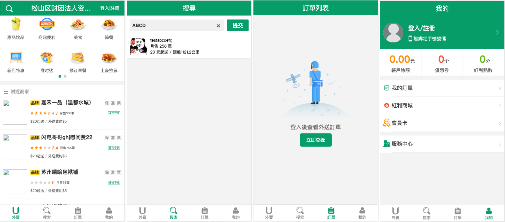
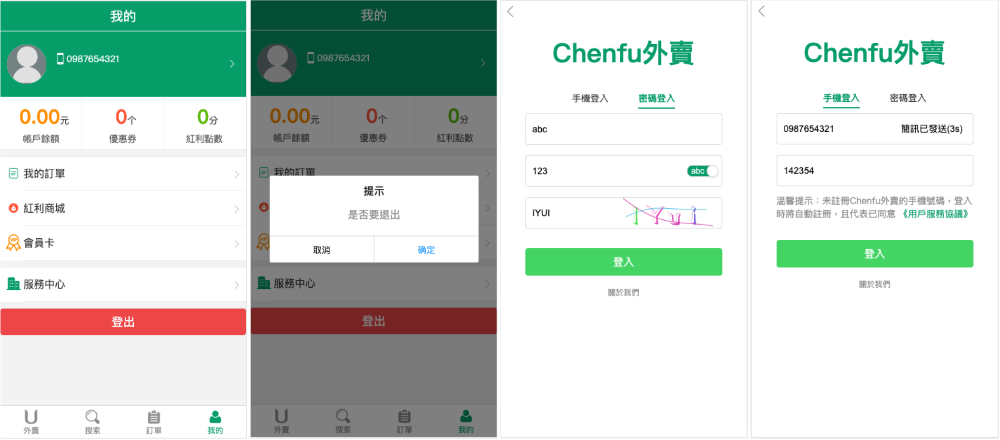
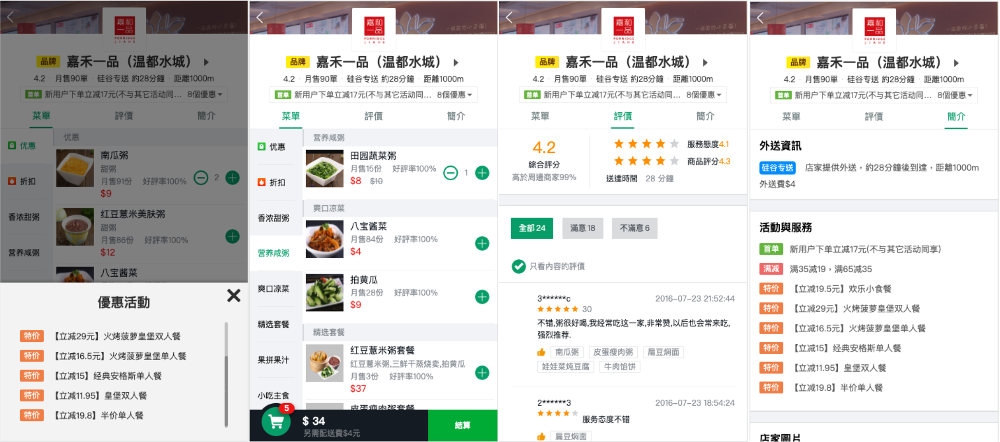
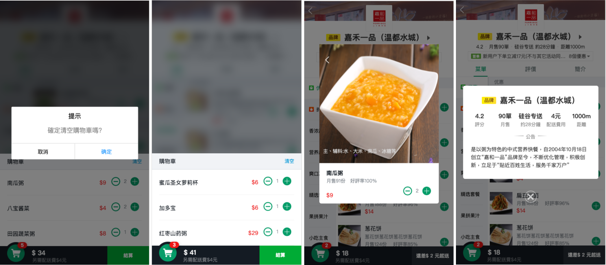

# goodShops_client

## 專案描述

1. 此為使用Vue2的模擬外賣 WebApp
2. 包含商品、商家、購物車、用戶等多個子模塊
3. 使用 Vue、Vuex、Vue-router、Vue-lazyload 實現單頁應用,數據管理,圖片懶加載
4. 使用 better-scroll、swiper、fastclick 處理移動端的使用者體驗
5. 使用 axios 處理外部api調用,使用 mockjs 提供測試資料協助前端專案開發

## 專案介面

### 一級路由(外賣頁面、搜尋頁面、訂單頁面、個人頁面)
<br><br>

### 登入頁面、用戶登入/登出功能
<br><br>

### 二級路由(商家菜單、商家評價、商家簡介)
<br><br>

### 購物車、商品簡述、商家簡述
<br><br>

## 專案路由

    [一級路由] (顯示底部導航)
        |--- /msite     ( Msite.vue   外賣頁面 )
        |--- /search    ( Search.vue  搜尋頁面 )
        |--- /order     ( Order.vue   訂單頁面 )
        |--- /profile   ( Profile.vue 個人頁面 )
        |
        |     (隱藏底部導航)
        |--- /login     ( Login.vue 登入頁面 )
        |--- /shop      ( Shop.vue  商家頁面 )

    [二級路由(商家)]
     (商家頁面)
        |--- /shop/goods   ( ShopGoods.vue   商家菜單 )
        |--- /shop/ratings ( ShopRatings.vue 商家評價 )
        |--- /shop/info    ( ShopInfo.vue    商家簡介 )

## API接口外部資料

    API接口資料
        1. 根據經緯度獲得位置詳情
        2. 取得食品分類清單
        3. 根據經緯度獲取商鋪清單
        4. 根據經緯度和關鍵字搜索商鋪列表
        5. 獲取一次性圖型驗證碼
        6. 登入_用戶名密碼
        7. 登入_手機號碼驗證碼
        8. 發送一次性短信驗證碼
        9. 根據會話獲取用戶信息
       10. 用戶帳號登出

[API接口資料細節](src/api/README.md)

    MockJs模擬資料
        1. 商家頁面-商家簡介 /shopInfo
        2. 商家頁面-商家評價 /shopRatings
        3. 商家頁面-商家菜單 /shopGoods

## 目錄結構

    [GoodShops]
        |--- build/           webpack相關配置文件
        |--- config/          webpack相關配置文件
                |--- index.js 指定後台服務port號,靜態資源文件夾
        |--- dist/            執行打包build生成的結果內容
        |--- node_modules/    node.js相關文件夾
        |---   src/           程式源碼文件夾
                |--- App.vue  應用組件
                |--- main.js  入口js
        |--- static/          靜態文件夾
        |--- .babelrc         babel配置文件
        |--- .editorconfig    專案的編碼格式配置(適用於多種IDE開發工具)
        |--- .eslintignore    eslint檢查忽略配置文件 
        |--- .eslintrc.js     eslint檢查配置文件
        |--- .gitignore       git版本控制忽略配置文件
        |--- index.html       主頁面文件
        |--- package.json     第三方套件配置文件
        |--- README.md        專案說明描述的readme文件

    [src文件夾]
        |--- api/        與後台交互模塊
        |--- common/     共用的資源項目
        |--- components/ 共用組件模塊
        |--- filters/    自定義過濾器模塊
        |--- mock/       資料模擬模塊(mockJs)
        |--- pages/      路由組件模塊
        |--- router/     路由器文件模塊(vue-router)
        |--- store/      數據模塊(vuex)
        |--- App.vue     應用組件
        |--- main.js    入口js


## 使用vue-cli搭建專案項目
[vue-cli相關資源](https://github.com/vuejs/vue-cli)

    npm install -g vue-cli      // vue-cli 第三方套件庫
    vue init webpack 資料夾名稱   // 創建專案
    
    cd 資料夾名稱
    npm install       // 專案構建
    npm run build     // 打包產製dist
    npm run dev       // 創建dev環境

    localhost:8080    // 訪問dev環境(config/index.js)


## Build Setup

``` bash
# install dependencies
npm install

# serve with hot reload at localhost:8080
npm run dev

# build for production with minification
npm run build

# build for production and view the bundle analyzer report
npm run build --report
```

For a detailed explanation on how things work, check out the [guide](http://vuejs-templates.github.io/webpack/) and [docs for vue-loader](http://vuejs.github.io/vue-loader).
